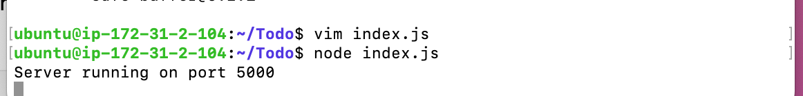
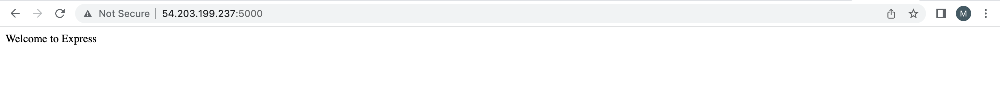
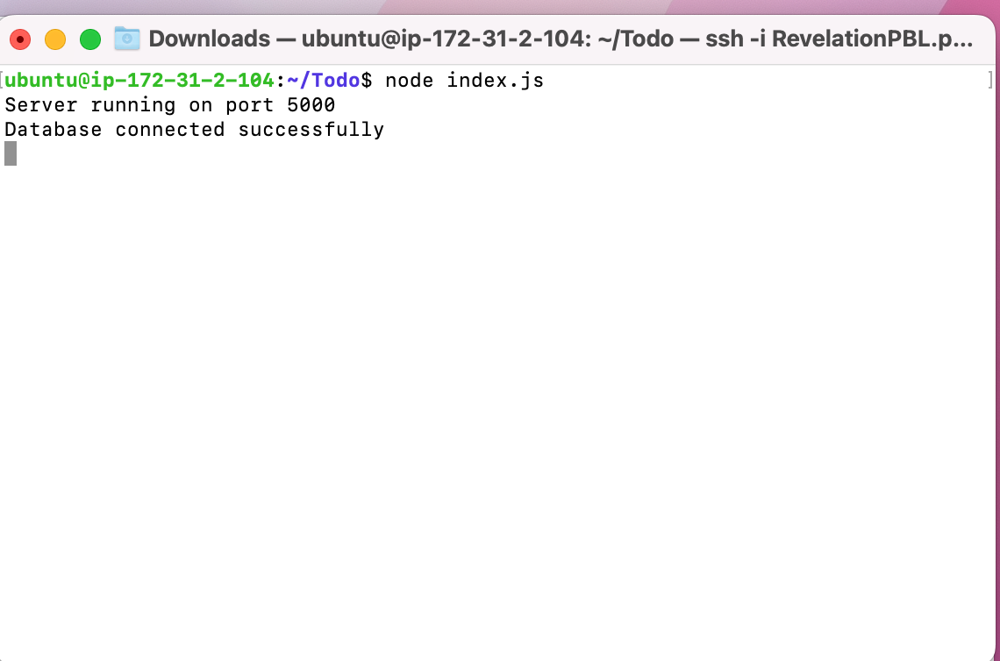
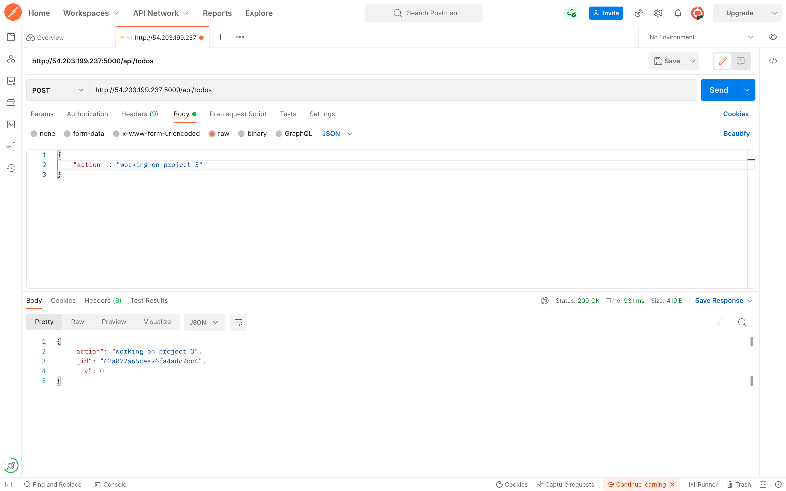
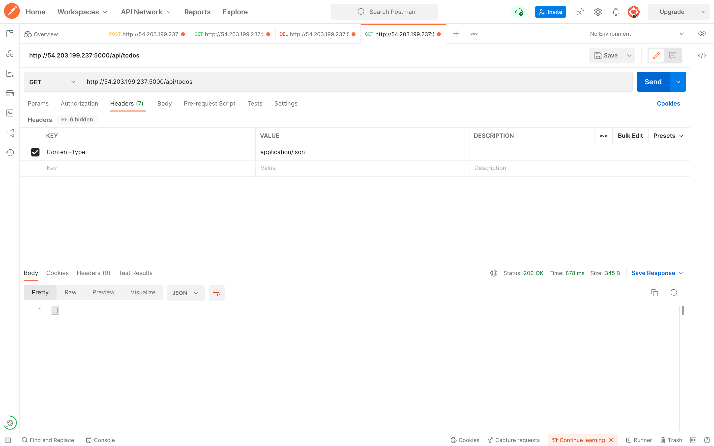
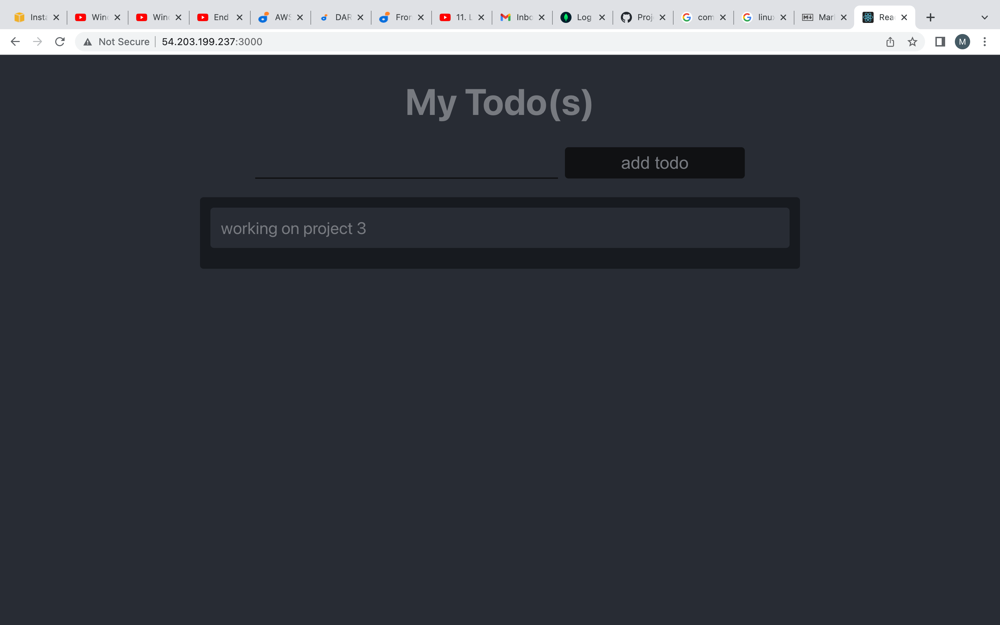

# Documentation of PROJECT 3: MERN STACK  IMPLEMENTATION

## Backend Configuration 

```
sudo  apt update
``` 
```
sudo apt upgrade
```

- I used the above commands to download and install the updates for each outdated package and dependency on my system.

```
curl -fsSL https://deb.nodesource.com/setup_18.x | sudo -E bash -
```

- I used  the above command to  get the location of Node.js software from Ubuntu repositories.

-  Then i installed Node.js and npm with the command below

```
sudo apt-get install -y nodejs
```

- verified the installation of Node.js and npm respectively with the code below

```
node -v
```
```
npm -v
```

-  Created a new directory for my To-Do Project

```
mkdir Todo
```

- Verified my todo directory by running the ls command 

- Then i changed my directory to the newly created directory

```
cd Todo
```

- I ran the code below to initialise my project, so that a new file named package.json will be created. This file normally contain information about the application and the dependencies that it needs to run.

```
npm init
```

## Installation of ExpressJS

- Installed expressJS using the code below:

```
npm install express
```

- After that i created a file called index.js opened the file and pasted the code below:

```
const express = require('express');
require('dotenv').config();

const app = express();

const port = process.env.PORT || 5000;

app.use((req, res, next) => {
res.header("Access-Control-Allow-Origin", "\*");
res.header("Access-Control-Allow-Headers", "Origin, X-Requested-With, Content-Type, Accept");
next();
});

app.use((req, res, next) => {
res.send('Welcome to Express');
});

app.listen(port, () => {
console.log(`Server running on port ${port}`)
});

```

- Started the server with the code below inside same directory

```
node index.js
```



*The above Image shows the server is currently running on port 5000*

- To access my server public IP on any browser i had to open port 5000 in my EC2 security group.



*The Image above shows the server's Public IP is being accessed from a browser*

- There are three actions that our To-Do application needs to be able to do:

1. Create a new task
2. Display list of all tasks
3. Delete a completed task
- Each task will be associated with some particular endpoint and will use different standard HTTP request methods: POST, GET, DELETE.

Hence, a route folder was created

```
mkdir routes
```

- Changed the directory to the routes directory

```
cd routes
```

- Created a file api.js and opened  the file with the command below respectively:

```
touch  api.js
```
```
vim api.js
```

- Copied and pasted the code below inside the file

```
const express = require ('express');
const router = express.Router();

router.get('/todos', (req, res, next) => {

});

router.post('/todos', (req, res, next) => {

});

router.delete('/todos/:id', (req, res, next) => {

})

module.exports = router;
```

- Since the app is going to make use of Mongodb which is a NoSQL database, i need to create a model and a schema. To create a Schema and a model, install mongoose which is a Node.js package that makes working with mongodb easier. Changed directory back to Todo director and Install it with the command below:

```
npm install mongoose
```

- Afterward i created a new folder called models with the code below:

```
mkdir models
```

- Changed the directory into the newly created ‘models’ folder with

```
cd models
```

- Created a file and named it todo.js

```
touch todo.js
```

- After that i copied and pasted the code below inside the todo.js file

```
const mongoose = require('mongoose');
const Schema = mongoose.Schema;

//create schema for todo
const TodoSchema = new Schema({
action: {
type: String,
required: [true, 'The todo text field is required']
}
})

//create model for todo
const Todo = mongoose.model('todo', TodoSchema);

module.exports = Todo;
```

- Subsequently i updated the routes from the file api.js in ‘routes’ directory to make use of the new model, deleted the existing code in the file, copied and pasted the code below inside the file.

```
const express = require ('express');
const router = express.Router();
const Todo = require('../models/todo');

router.get('/todos', (req, res, next) => {

//this will return all the data, exposing only the id and action field to the client
Todo.find({}, 'action')
.then(data => res.json(data))
.catch(next)
});

router.post('/todos', (req, res, next) => {
if(req.body.action){
Todo.create(req.body)
.then(data => res.json(data))
.catch(next)
}else {
res.json({
error: "The input field is empty"
})
}
});

router.delete('/todos/:id', (req, res, next) => {
Todo.findOneAndDelete({"_id": req.params.id})
.then(data => res.json(data))
.catch(next)
})

module.exports = router;
```

- Next i created a MongoDB database using MLab DBaaS. Created a cluster and database in the MLab. then i generated the connection string with the password and add it to the .env file.


- The index.js file was updated in other to reflect the use of .env so that Node.js can connect to the database. after whcih the index.js file was updated, deleted the existing code copied the code below and pasted inside the file.

```
const express = require('express');
const bodyParser = require('body-parser');
const mongoose = require('mongoose');
const routes = require('./routes/api');
const path = require('path');
require('dotenv').config();

const app = express();

const port = process.env.PORT || 5000;

//connect to the database
mongoose.connect(process.env.DB, { useNewUrlParser: true, useUnifiedTopology: true })
.then(() => console.log(`Database connected successfully`))
.catch(err => console.log(err));

//since mongoose promise is depreciated, we overide it with node's promise
mongoose.Promise = global.Promise;

app.use((req, res, next) => {
res.header("Access-Control-Allow-Origin", "\*");
res.header("Access-Control-Allow-Headers", "Origin, X-Requested-With, Content-Type, Accept");
next();
});

app.use(bodyParser.json());

app.use('/api', routes);

app.use((err, req, res, next) => {
console.log(err);
next();
});

app.listen(port, () => {
console.log(`Server running on port ${port}`)
});

```
- Started the server with:

```
node index.js
```


*The image above shows that the database was succesfully connected*

- Testing Backend Code without Frontend using RESTful API So far the backend part of our To-Do application has been written, and a database has been configured, but we do not have a frontend UI yet. We need ReactJS code to achieve that. In this project, Postman was used to test our API. DOwnloaded Postman on my system. used it to create a postand get request, above image shows the result for the post and get request respectively.





## FRONTEND CREATION

- Since we are done with the functionality we want from our backend and API, We created a user interface for a Web client (browser) to interact with the application via API. To start out with the frontend of the To-do app, the `create-react-app`  command was used to scaffold our app.

- The code below was initialised from the Todo directory
```
npx create-react-app client
```
*This will create a new folder in your Todo directory called client, where you will add all the react code.*

- Before testing the react app, there are some dependencies that need to be installed.

```
npm install concurrently --save-dev
```

*concurrently. It is used to run more than one command simultaneously from the same terminal window.*

```
npm install nodemon --save-dev
```

*nodemon. It is used to run and monitor the server. If there is any change in the server code, nodemon will restart it automatically and load the new changes.*

- In the Todo folder the package.json file. The  part of the code that has "script": ... was replaced  with the code below

```
"scripts": {
"start": "node index.js",
"start-watch": "nodemon index.js",
"dev": "concurrently \"npm run start-watch\" \"cd client && npm start\""
},
```
- Afterward i changed the directory back to client and opened the package.json file with

```
cd client
```

```
vi package.json
```

-  Then added the key value pair

```
"proxy": "http://localhost:5000",
```

*the reason for doing this is to make it possible to access the application directly from the browser by simply calling the server url like http://localhost:5000 rather than always including the entire path like http://localhost:5000/api/todos*

- From the Todo directory, the command below was used to open  the app

```
npm run dev
```
- In order to be able to access the application from the Internet i had to open TCP port 3000 on EC2 by adding a new Security Group rule.

- One of the advantages of react is that it makes use of components, which are reusable and also makes code modular. For our Todo app, there will be two stateful components and one stateless component.

```
cd client
```

```
cd src
```
- Inside the src folder created another folder called components

```
mkdir components
```
- Moved into the components directory with

```
cd components
```

- Inside ‘components’ directory created three files Input.js, ListTodo.js and Todo.js. with

```
touch Input.js ListTodo.js Todo.js
```

- Opened Input.js file

```
vi Input.js
```
- then copied and pasted the code below:

```
import React, { Component } from 'react';
import axios from 'axios';

class Input extends Component {

state = {
action: ""
}

addTodo = () => {
const task = {action: this.state.action}

    if(task.action && task.action.length > 0){
      axios.post('/api/todos', task)
        .then(res => {
          if(res.data){
            this.props.getTodos();
            this.setState({action: ""})
          }
        })
        .catch(err => console.log(err))
    }else {
      console.log('input field required')
    }

}

handleChange = (e) => {
this.setState({
action: e.target.value
})
}

render() {
let { action } = this.state;
return (
<div>
<input type="text" onChange={this.handleChange} value={action} />
<button onClick={this.addTodo}>add todo</button>
</div>
)
}
}

export default Input

```
- Used the command below to install axios from the client  folder

```
npm install axios
```
*Axios is a promise-based HTTP Client for node.js and the browser.*

- From components directory, i  opened the ListTodo.js file with

```
vi  ListTodo.js
```

- Then pasted copied  and pasted the following code into the ListTodo.js file

```
mport React from 'react';

const ListTodo = ({ todos, deleteTodo }) => {

return (
<ul>
{
todos &&
todos.length > 0 ?
(
todos.map(todo => {
return (
<li key={todo._id} onClick={() => deleteTodo(todo._id)}>{todo.action}</li>
)
})
)
:
(
<li>No todo(s) left</li>
)
}
</ul>
)
}

export default ListTodo
```

- Then in  Todo.js file i inputed the following code

```
import React, {Component} from 'react';
import axios from 'axios';

import Input from './Input';
import ListTodo from './ListTodo';

class Todo extends Component {

state = {
todos: []
}

componentDidMount(){
this.getTodos();
}

getTodos = () => {
axios.get('/api/todos')
.then(res => {
if(res.data){
this.setState({
todos: res.data
})
}
})
.catch(err => console.log(err))
}

deleteTodo = (id) => {

    axios.delete(`/api/todos/${id}`)
      .then(res => {
        if(res.data){
          this.getTodos()
        }
      })
      .catch(err => console.log(err))

}

render() {
let { todos } = this.state;

    return(
      <div>
        <h1>My Todo(s)</h1>
        <Input getTodos={this.getTodos}/>
        <ListTodo todos={todos} deleteTodo={this.deleteTodo}/>
      </div>
    )

}
}

export default Todo;

```
- Adjusted the react code, copied and pasted the code below into App.js from the src folder

```
import React from 'react';

import Todo from './components/Todo';
import './App.css';

const App = () => {
return (
<div className="App">
<Todo />
</div>
);
}

export default App;
```

- After  pasting, exit the editor. In the src directory open the App.css

```
vi App.css
```

- Then paste the following code into App.css:

```
.App {
text-align: center;
font-size: calc(10px + 2vmin);
width: 60%;
margin-left: auto;
margin-right: auto;
}

input {
height: 40px;
width: 50%;
border: none;
border-bottom: 2px #101113 solid;
background: none;
font-size: 1.5rem;
color: #787a80;
}

input:focus {
outline: none;
}

button {
width: 25%;
height: 45px;
border: none;
margin-left: 10px;
font-size: 25px;
background: #101113;
border-radius: 5px;
color: #787a80;
cursor: pointer;
}

button:focus {
outline: none;
}

ul {
list-style: none;
text-align: left;
padding: 15px;
background: #171a1f;
border-radius: 5px;
}

li {
padding: 15px;
font-size: 1.5rem;
margin-bottom: 15px;
background: #282c34;
border-radius: 5px;
overflow-wrap: break-word;
cursor: pointer;
}

@media only screen and (min-width: 300px) {
.App {
width: 80%;
}

input {
width: 100%
}

button {
width: 100%;
margin-top: 15px;
margin-left: 0;
}
}

@media only screen and (min-width: 640px) {
.App {
width: 60%;
}

input {
width: 50%;
}

button {
width: 30%;
margin-left: 10px;
margin-top: 0;
}
}
```

- Exit, In the src directory opened the index.css

```
vim index.css
```

Copied and pasted the code below:

```
body {
margin: 0;
padding: 0;
font-family: -apple-system, BlinkMacSystemFont, "Segoe UI", "Roboto", "Oxygen",
"Ubuntu", "Cantarell", "Fira Sans", "Droid Sans", "Helvetica Neue",
sans-serif;
-webkit-font-smoothing: antialiased;
-moz-osx-font-smoothing: grayscale;
box-sizing: border-box;
background-color: #282c34;
color: #787a80;
}

code {
font-family: source-code-pro, Menlo, Monaco, Consolas, "Courier New",
monospace;
}
```
- From Todo directory the command below was initiated 

```
npm run dev
```



*The image above shows that my todo app is fully functioning with the functionality to create a task, delete a task and viewing all tasks.*